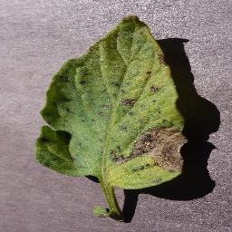
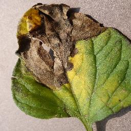
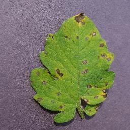
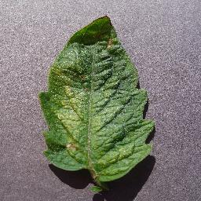
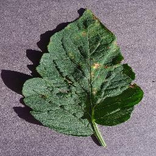
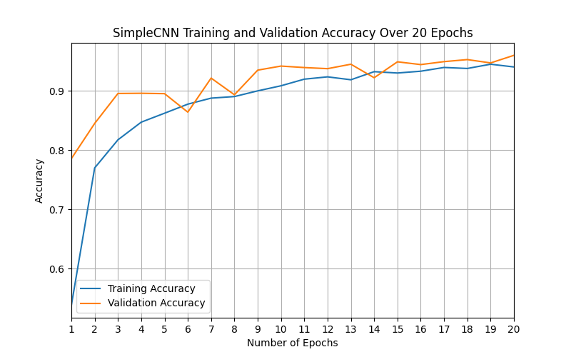
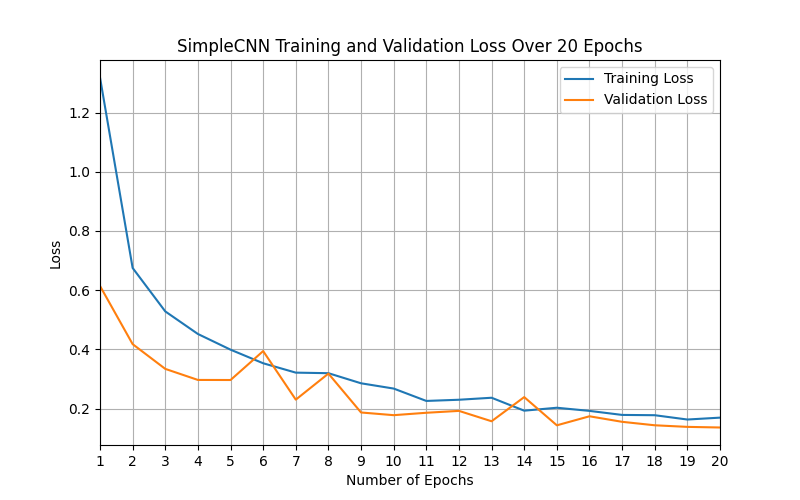
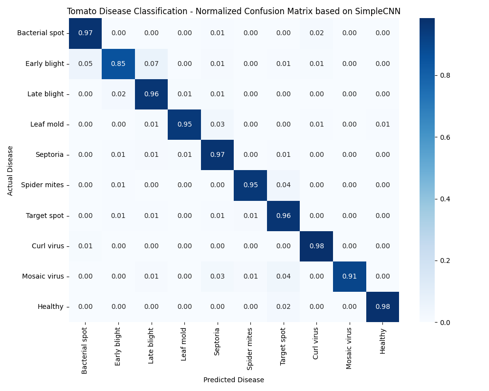

<p align="left">
  
  
  
  
  
</p>

<p align="center">
  
</p>

# Crop Disease Classification with PyTorch and Computer Vision

## Table of Contents
- [Overview](#overview)
- [Tomato Leaf Disease Classes](#tomato-leaf-disease-classes)
  - [Class Overview](#class-overview)
  - [Example images](#example-images)
- [Project Structure](#project-structure)
- [Virtual Environment Setup](#virtual-environment-setup)
- [Kaggle CLI Setup](#kaggle-cli-setup)
- [Download the PlantVillage Dataset](#download-the-plantvillage-dataset)
- [Prepare the Tomato Subset (train/val split)](#prepare-the-tomato-subset-trainval-split)
- [Pipeline Verification](#pipeline-verification)
- [Model Training](#model-training)
  - [Choosing the Model Architecture](#choosing-the-model-architecture)
  - [Customizing the Number of Epochs](#customizing-the-number-of-epochs)
  - [Data Augmentation](#data-augmentation)
  - [What Happens During Training](#what-happens-during-training)
- [Model Export (TorchScript & ONNX)](#model-export-torchscript--onnx)
- [Single‑Image Inference](#single-image-inference)
  - [Using a training checkpoint](#using-a-training-checkpoint)
  - [Using a TorchScript model](#using-a-torchscript-model)
  - [Using an ONNX model](#using-an-onnx-model)
  - [What happens during inference](#what-happens-during-inference)
- [Deployment & Docker Inference Server](#deployment--docker-inference-server)
  - [Build the Docker Image](#build-the-docker-image)
  - [Run the Inference Server (CPU mode)](#run-the-inference-server-cpu-mode)
  - [Run with GPU Acceleration (Cloud or CI)](#run-with-gpu-acceleration-cloud-or-ci)
- [API Architecture Overview](#api-architecture-overview)
  - [Key Features](#key-features)
- [VS Code Tasks](#vs-code-tasks)
- [Results](#results)
  - [Training and Validation Accuracy](#training-and-validation-accuracy)
  - [Training and Validation Loss](#training-and-validation-loss)
  - [Normalized Confusion Matrix](#normalized-confusion-matrix)
  - [Performance Summary](#performance-summary)
- [Future Work](#future-work)
  - [Model and Training Improvements](#model-and-training-improvements)
  - [Deployment and Inference Enhancements](#deployment-and-inference-enhancements)
  - [Data and Evaluation Extensions](#data-and-evaluation-extensions)
  - [Documentation and Developer Experience](#documentation-and-developer-experience)
- [License](#license)

## Overview
This project implements a complete, production‑minded machine‑learning pipeline for classifying tomato leaf diseases using the PlantVillage dataset. It is designed to demonstrate professional ML engineering practices rather than just model training. The pipeline covers the full lifecycle from dataset preparation to deployment‑ready model export, with a strong focus on clarity, modularity, and reproducibility.

**The project includes:**
- A configurable PyTorch training pipeline supporting multiple architectures (SimpleCNN, ResNet‑18, and easily extendable backbones)
- A clean dataset preparation workflow for extracting and splitting the tomato subset of PlantVillage
- A unified model factory enabling scalable architecture selection
- Built‑in pipeline verification tests for dataset integrity, model sanity checks, and project structure validation
- Automatic generation of training curves and a normalized confusion matrix
- Export to TorchScript and ONNX for deployment on diverse platforms
- A fully architecture‑aware inference script supporting checkpoints, TorchScript, and ONNX models
- Optional VS Code tasks for one‑click execution of training, testing, export, and inference

The goal is to provide a compact but realistic example of how to structure, train, evaluate, and deploy a computer‑vision model in a way that is maintainable, reproducible, and ready for integration into real‑world systems.


## Tomato Leaf Disease Classes
The *PlantVillage* tomato data set that it used for this project contains ten visually distinct classes, covering both healthy leaves and a range of fungal, bacterial, viral, and pest‑related diseases The following example images illustrate the visual patterns the model learns to recognize.

### Class Overview
- **Healthy** – uniform green coloration, no lesions or discoloration  
- **Bacterial Spot** – small dark lesions, often with yellow halos  
- **Early Blight** – brown lesions with concentric “target‑like” rings  
- **Late Blight** – irregular dark patches with pale or water‑soaked borders  
- **Leaf Mold** – yellow patches on the upper surface, olive‑green mold on the underside  
- **Septoria Leaf Spot** – many small circular spots with dark borders and light centers  
- **Spider Mites (Two‑spotted)** – tiny white/yellow speckles, sometimes with fine webbing  
- **Target Spot** – larger circular lesions with concentric rings  
- **Tomato Mosaic Virus** – mottled, mosaic‑like yellow/green patterns  
- **Tomato Yellow Leaf Curl Virus** – severe curling, stunting, and chlorosis of young leaves  

### Example images

The table below shows one representative image per class. Image paths assume a small curated set stored under ```images/``` in the project root.

| Healthy | Bacterial Spot | Early Blight | Late Blight | Leaf Mold |
|--------|----------------|--------------|-------------|-----------|
|  |  |  |  |  |

| Septoria Leaf Spot | Spider Mites (Two‑spotted) | Target Spot | Tomato Mosaic Virus | Tomato Yellow Leaf Curl Virus |
|--------------------|----------------------------|-------------|----------------------|-------------------------------|
|  |  |  |  |  |
## Project Structure
```
├── Dockerfile
├── data/
│   ├── raw/         # Downloaded dataset
│   └── processed/
│       ├── train/   # Training split
│       └── val/     # Validation split
│
├── results/
│   ├── plots/                # Accuracy/loss curves + confusion matrix
│   └── model_checkpoint.pth  # Saved model weights (after training)
│
├── scripts/
│   ├── export_model.py         # Export model to TorchScript/ONNX
│   └── split_tomato_dataset.sh # Tomato-only dataset preparation
│
├── src/
│   └── api/
│   │   ├── dependencies/
│   │   │   ├── config.py          # environment-driven config
│   │   │   ├── logging.py         # logging middleware
│   │   │   └── exceptions.py      # exception handlers
│   │   ├── routes/
│   │   │   ├── health.py          # /health and /ready endpoints
│   │   │   └── predict.py
│   │   ├── services/
│   │   │   ├── model_loader.py
│   │   │   ├── preprocessing.py
│   │   │   └── postprocessing.py
│   │   └── server.py              # FastAPI app + startup/shutdown events
│   ├── evaluation/
│   │   └── confusion_matrix.py             # Normalized confusion matrix generation
│   ├── models/
│   │   ├── convolutional_neural_network.py # Simple CNN model
│   │   ├── export.py                       # TorchScript/ONNX export utilities
│   │   └── model_factory.py                # Model architectures for training and inference
│   ├── visualization/
│   │   └── plot_metrics.py                  # Accuracy/loss curve plotting
│   ├── config.py                            # Centralized configuration settings
│   ├── dataset.py                           # Custom dataset loader
│   ├── inference.py                         # Single-image inference script
│   └── train.py                             # Full training pipeline + tests
│
├── weights/
│   └── .gitkeep
│
├── README.md
├── requirements.txt
└── requirements.inference.txt
```

## Virtual Environment Setup
Create and activate a virtual environment:

```bash
python3 -m venv .crop-disease-venv
source .crop-disease-venv/bin/activate
```

Install dependencies:

```bash
pip install -r requirements.txt
```

## Kaggle CLI Setup
The current Kaggle CLI still requires the legacy authentication method.

1. Go to: **https://www.kaggle.com/** and create an account (necessary for creating an API token and downloading the dataset)

2. Navigate to: **https://www.kaggle.com/settings**
3. Under *API*, click **Create Legacy API Key**
   This downloads a file named ```kaggle.json```
4. Move it to the correct location:
   ```bash
   mkdir -p ~/.kaggle
   mv ~/<Download_Directory>/kaggle.json ~/.kaggle/
   chmod 600 ~/.kaggle/kaggle.json
   ```
5. Test authentification:
   ```bash
   kaggle datasets list -s plant
   ```
If dataset results are shown, authentication is working.

## Download the PlantVillage Dataset
Inside the project root:

```bash
mkdir -p data/raw
kaggle datasets download -d emmarex/plantdisease -p data/raw
```

Extract it:

```bash
unzip data/raw/plantdisease.zip -d data/raw/plant_disease_labeled_images
```

Optionally, the zipped folder can now be deleted to avoid unnecesary memory allocation:

```bash
rm data/raw/plantdisease.zip
```

## Prepare the Tomato Subset (train/val split)
As of now, training the CNN will be limited on images of tomato leaves.

This project includes a robust Bash script that:
 - focusses solely on tomato leaf images
 - handles nested folder structures
 - handles filenames with spaces
 - handles ```.jpg```, ```.JPG```, ```.jpeg```, ```.JPEG```, ```.png```, etc.
 - splits into train/val sets (currently set to a 4:1 ratio)
 - preserves class names

Run it:

```bash
chmod +x scripts/split_tomato_dataset.sh
./scripts/split_tomato_dataset.sh
```

Running the script should result in newly created class folders:

```
data/processed/train/<class>/
data/processed/val/<class>/
```

## Pipeline Verification
Before training, the project provides built‑in checks to ensure everything is correctly set up.

Run all checks:

```bash
python -m src.train --test all
```

Or run a specific check:

```bash
python -m src.train --test project_structure # Project structure check
python -m src.train --test dataset           # Dataset & DataLoader check
python -m src.train --test model             # Model forward-pass check
```

**What the checks validate**
 - Project structure: Ensures required directories exist.
 - Dataset & DataLoader: Confirms the processed dataset loads correctly and batches are valid.
 - Model sanity check: Builds the CNN model and runs a forward pass to verify output shapes.

These checks ensure the pipeline is stable and ready for training.

## Model Training

The training pipeline supports multiple neural‑network architectures and provides configurable options for epochs, augmentation, and backbone selection. All models are trained on the processed tomato leaf dataset located under ```data/processed/```.

Train with **default settings** (SimpleCNN, 5 epochs, no augmentation):

```bash
python -m src.train --train
```

### Choosing the Model Architecture
Two architectures are currently supported:

 - **SimpleCNN** – lightweight baseline for quick experiments
 - **ResNet‑18 (pretrained)** – ImageNet‑initialized backbone fine‑tuned on the tomato leaf dataset

Select the architecture using:

```bash
python -m src.train --train --model-architecture {simplecnn, resnet18}
```

If omitted, the default is **SimpleCNN**.

### Customizing the Number of Epochs
Specify a custom number of epochs:

```bash
python -m src.train --train --epochs <desired_number_of_epochs>
```
This can be combined with chosing a specific model architecture:

```bash
python -m src.train --train --epochs <desired_number_of_epochs> --model-architecture {simplecnn, resnet18}
```

### Data Augmentation
Augmentation improves robustness by simulating natural variation in agricultural imagery. The training pipeline applies biologically plausible transformations such as horizontal flips, small rotations, and mild color jitter.

Enable or disable augmentation explicitly:
```bash
python -m src.train --train --augment {yes, no}
```

Validation transforms remain deterministic to ensure consistent evaluation.

### What Happens During Training
The training script:

 - loads the training and validation datasets
 - applies augmentation if enabled
 - selects the best available compute device
 - instantiates the chosen architecture
 - logs a full layer‑by‑layer model summary and parameter count
 - trains using cross‑entropy loss and the Adam optimizer
 - evaluates after each epoch
 - saves accuracy/loss curves and a normalized confusion matrix
 - writes a checkpoint containing weights, class names, and metadata

All plots are saved under:
```
results/plots/
```

The final checkpoint is saved as:
```
results/model_checkpoint.pth
```

Log files are stored under:
```
results/training.log
```

## Model Export (TorchScript & ONNX)
After training, the model can be exported to deployment‑ready formats. This project supports:
 - TorchScript (.pt) for PyTorch‑based deployment
 - ONNX (.onnx) for cross‑framework and edge‑device deployment

Export the trained model:
```bash
python -m scripts.export_model --checkpoint results/model_checkpoint.pth --out-dir exports/
```

This generates:

```
exports/model_torchscript.pt    # TorchScript model
exports/model_onnx.onnx         # ONNX model
exports/model_onnx.onnx.data    # ONNX model
```
Note: Large ONNX models may be split into ```model_onnx.onnx``` (graph) and ```model_onnx.onnx.data``` (weights). This is normal and follows the ONNX external data format.

These artifacts can be used for mobile, embedded, or real‑time inference pipelines.


**Note:** Export always runs on CPU to ensure stable TorchScript and ONNX generation.

## Single Image Inference
The inference pipeline supports three model formats: the **training checkpoint**, the **exported TorchScript model**, and the **exported ONNX model**. All formats use the same command‑line interface and produce a predicted class label together with a confidence score.

Inference is architecture‑agnostic: the model architecture is encoded inside the exported file or checkpoint, so no architecture flag is required.

### Using a training checkpoint
A checkpoint contains the model weights, class names, and metadata saved after training.

```bash
python -m src.inference --model-type checkpoint --model-path results/model_checkpoint.pth --image <path_to_image>
```

### Using a TorchScript model
TorchScript models are suitable for PyTorch‑based deployment environments.

```bash
python -m src.inference --model-type torchscript --model-path exports/model_torchscript.pt --image <path_to_image>
```

### Using an ONNX model
ONNX models support cross‑framework and edge‑device inference. Large models may be split into a ```.onnx``` graph file and a ```.onnx.data``` weights file; in such cases, pass the ```.onnx``` file without the ```.data``` suffix.

```bash
python -m src.inference --model-type onnx --model-path exports/model_onnx.onnx --image <path_to_image>
```

### What happens during inference
The inference script:
 - loads the selected model format (checkpoint, TorchScript, or ONNX)
 - applies the same preprocessing transforms used during validation
 - runs a forward pass on the input image
 - computes the predicted class and confidence score
 - prints the result to the console
 - Inference always runs on CPU to ensure compatibility across environments.


## Deployment & Docker Inference Server
This project includes a **production‑minded, GPU‑ready Dockerized inference server** built with **FastAPI**.
The goal is to provide a clean, reproducible, and deployment‑ready environment for running the trained tomato‑disease classifier in real‑world systems.

**Why Docker?**

Docker ensures:
 - Reproducible inference environments
 - Clean separation between training and deployment dependencies
 - GPU‑accelerated inference using CUDA (when available)
 - Easy integration into CI/CD pipelines and Kubernetes clusters
 
 The Docker image uses a minimal inference‑only dependency set and installs the CUDA‑enabled PyTorch wheel inside the container.
 
---

### Build the Docker Image
From the project root:

```bash
docker build -t crop-disease-api .
```

This builds a GPU‑ready image using:
 - requirements.inference.txt
 - src/api/server.py
 - exported model weights under weights/

---

### Run the Inference Server (CPU Mode)
Even without a GPU, the API can be fully tested locally:

```bash
docker run -p 8000:8000 crop-disease-api
```

Then open:
```http://localhost:8000/health```

should result in:
```json
{"status": "ok"}
```

This validates:
 - container startup
 - FastAPI routing
 - model loading (CPU fallback)
 - preprocessing & postprocessing
 - inference pipeline (CPU)

---

### Run with GPU Acceleration (Cloud or CI)
Local GPU inference may not be available on all systems (e.g., Intel GPUs on Ubuntu 24.04).
To test CUDA inference, run the container on a GPU‑enabled environment such as:
 - GitHub Actions GPU runners
 - AWS EC2 (g4dn / g5 instances)
 - RunPod
 - Paperspace
 - Lambda Labs

Example:
```bash
docker run --gpus all -p 8000:8000 crop-disease-api
```

Inside the container:
```bash
python -c "import torch; print(torch.cuda.is_available())"
```

Expected output on GPU: ```True```

## API Architecture Overview

The project includes a modular, production‑grade FastAPI architecture designed for scalable and maintainable model deployment.
This API layer provides the foundation for GPU‑accelerated inference, observability, and future extensions such as batching, metrics, and CI/CD validation.

### Key Features
 - Modular folder structure under ```src/api/```
 - Environment‑driven configuration (```config.py```)
 - JSON logging middleware with automatic request‑ID injection
 - Centralized exception handling for validation and server errors
 - Dedicated system endpoints:
   - ```/health``` — liveness probe
   - ```/ready``` — readiness probe (model‑loading aware)
 - Startup and shutdown lifecycle hooks for initializing and cleaning up resources
 - Docker‑first design for reproducible inference environments

## VS Code Tasks

This project includes a set of preconfigured VS Code tasks located in ```.vscode/tasks.json```. They provide one‑click execution for training, testing, inference, and model export. Each task prompts for required inputs (e.g., model path, number of epochs) and uses the project’s virtual environment automatically. These tasks are optional and intended to streamline development; all functionality still remains available through the standard CLI commands described above.

## Results
Training the **SimpleCNN** model for **20 epochs** produced a set of evaluation artifacts that illustrate how the model learned over time and how well it generalizes to unseen tomato leaf images. These artifacts are stored under ```results/plots/``` and include accuracy and loss curves as well as a normalized confusion matrix.

### Training and Validation Accuracy
The model shows a smooth and stable learning trajectory across 20 epochs. Accuracy improves rapidly during the first five epochs (from **53.8% → 86.2%**), then continues to rise steadily. Validation accuracy remains consistently high throughout training and reaches a final value of **95.97%**.

This pattern indicates strong generalization and no signs of overfitting.



### Training and Validation Loss
Training loss decreases from **1.32 → 0.17**, while validation loss follows a similar trend, ending at **0.14**. The close alignment between the two curves demonstrates that the model maintains stable generalization and avoids divergence or instability.



### Normalized Confusion Matrix
The confusion matrix highlights strong per‑class performance across all ten tomato leaf disease categories. Most classes achieve **>90%** normalized accuracy. The model performs particularly well on:
 - Healthy
 - Curl virus
 - Spider mites
 - Target spot

Misclassifications occur primarily between visually similar fungal diseases (e.g., **Early blight** vs. **Late blight**). This pattern is expected and highlights where more advanced architectures or transfer learning can provide significant improvements.



### Performance Summary
 - **Final Training Accuracy:** 94.01%
 - **Final Validation Accuracy:** 95.97%
 - **Final Training Loss:** 0.1695
 - **Final Validation Loss:** 0.1362
 - **Strong per‑class performance** with minimal confusion between disease categories
 - **Stable convergence** with no overfitting
 - **Robust evaluation suite** including accuracy/loss curves and a normalized confusion matrix

These results demonstrate that even a lightweight CNN can achieve strong performance on the tomato leaf disease dataset, though the gap between training and validation accuracy suggests that more expressive models (e.g., ResNet18, MobileNetV2) will likely yield further gains.

## Future Work
The current pipeline is complete and fully functional, but several extensions can further improve performance, robustness, and deployability. These items are grouped by theme to reflect the project’s long‑term direction.

### Model and Training Improvements
- Add more pretrained backbones (MobileNetV3, EfficientNet‑B0, ConvNeXt‑Tiny) for benchmarking.
- Perform systematic hyperparameter tuning (learning rate schedules, optimizers, batch sizes).
- Introduce advanced augmentations tailored to agricultural imagery (CutMix, RandAugment).
- Add pruning or knowledge distillation for lightweight edge‑deployment models.
- Evaluate cross‑validation or a dedicated test split for more rigorous generalization metrics.

### Deployment and Inference Enhancements
- Containerize the entire pipeline with Docker for reproducible training and inference.
- Benchmark TorchScript and ONNX Runtime latency on CPU/GPU for real‑time use cases.
- Add optional INT8 or FP16 quantization for edge devices.
- Provide a minimal REST API or CLI wrapper for batch inference.

### Data and Evaluation Extensions
- Add per‑class accuracy tables and error analysis to highlight difficult disease pairs.
- Explore dataset balancing or synthetic data generation for underrepresented classes.
- Integrate Grad‑CAM or similar methods for explainability.

### Documentation and Developer Experience
- Add a Quickstart section with the most common commands.
- Provide a comparison table of all supported architectures and their performance.
- Add a reproducibility checklist (dataset version, seeds, environment).
- Expand the VS Code tasks to include Dockerized workflows once available.

## License 
This project is released under the MIT License, a permissive open‑source license that allows reuse, modification, and distribution with minimal restrictions.
